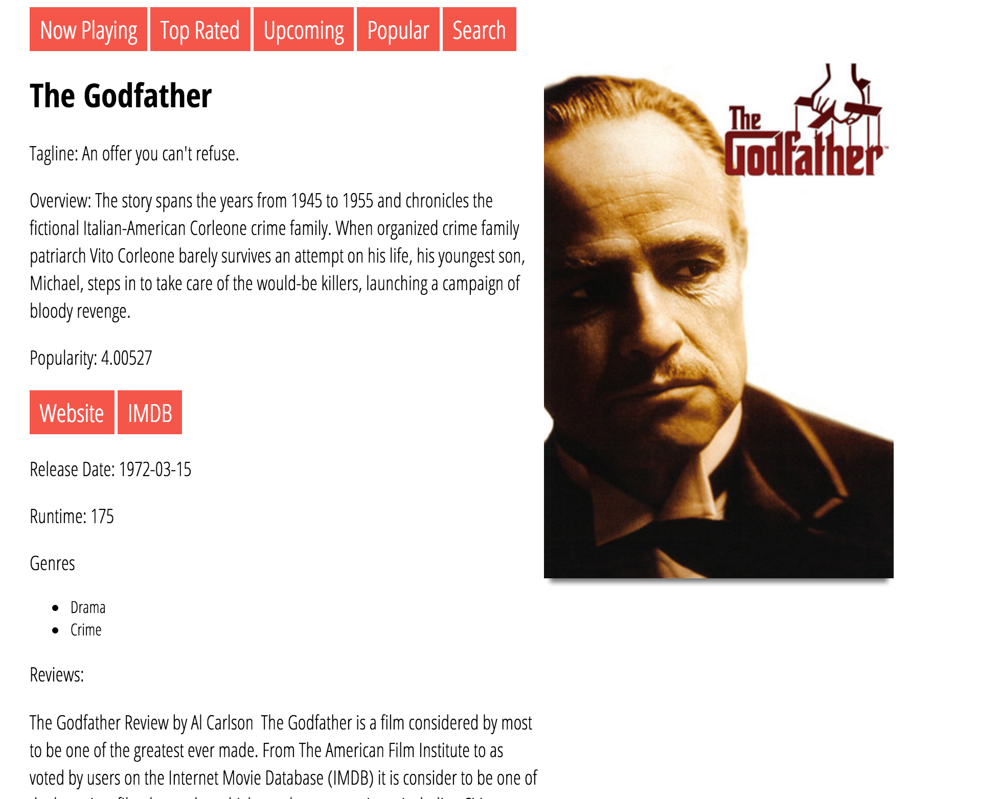

# Movie App with AngularJS
A movie app that allows the user to view movies now playing, top rated, upcoming, popular, and the ability to search. Implemented with HTML, CSS, JavaScript, and AngularJS.

# Screenshot

# View
Take a look [here!](http://kyleluck.github.io/movie-app-angular)
